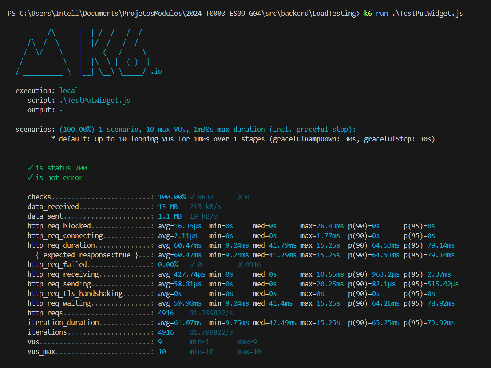

# Ponderada de teste k6

K6 é uma ferramenta de teste de desempenho e carga de código aberto que simula tráfego para um serviço web, permitindo aos desenvolvedores quantificar o impacto de alterações no código sobre a escalabilidade e a resposta sob diferentes condições de carga.

O k6 é importante por conta da sua capacidade de revelar gargalos e limites de performance antes que se tornem problemas em ambientes de produção, ajudando as equipes a entregar aplicações mais robustas e confiáveis.

Para execução dos testes foi configurado cenários de teste com tempo de 1 minuto

```
this.options = {
            stages: [
                { "duration": "1m", "target": 10 },
            ],
        };
    }
```

## Resultado do teste K6 para o Put:
</img>

### Aprendizados

Ao utilizar o k6 no meu projeto, obtive uma compreensão valiosa sobre como as aplicações se comportam sob estresse, o que me permitiu identificar gargalos de desempenho de forma proativa. A elaboração de scripts de teste desafiou e expandiu minhas habilidades técnicas, pois aprendi a simular comportamentos de um cenário real de uso da aplicação e a construir cenários complexos de testes de carga. Este processo também reforçou a importância da automação e da integração contínua em meus fluxos de trabalho, assegurando que as otimizações sejam baseadas em insights quantitativos, e não apenas em suposições, levando a uma entrega de software mais eficiente e robusta.
